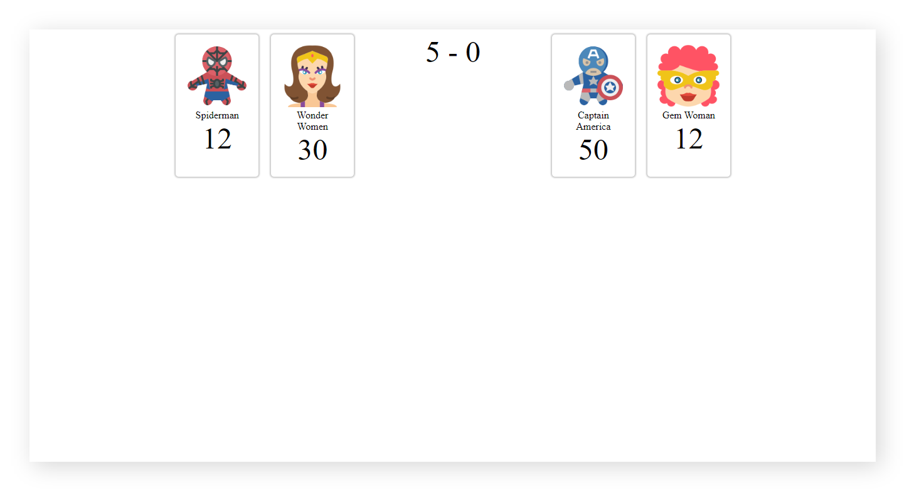

# ProGrad Lab | Superwars Stage 1

## Introduction

Dustin and Lucus are best friends. They spend their weekends watching superhero series and playing superhero games. One Friday at school Mr.Hooper, their computer science faculty taught them HTML, CSS, and JavaScript. Dustin & Lucus realised they could build super cool super hero stuff using their knowledge. 

The subsequent weekend, they decided to do it. Lucus and Dustin are now all set to build something super cool.

Lucus always loves protagonists like most of us. But Dustin is quite crazy, he likes antagonists. So they decided to collect a bunch of their favorite Super Heroes and Super Villains names along with their pictures. Did they tell you about the game that they are gonna build? 

Okay, let us explain. They are going to facilitate the ultimate war between Super Heroes and Super Villains. As they are new to these technologies, they need a **ProGrad** to help them build this game.

## What should you do
```
Fork this repo
Clone this repo
Practice CSS - Flexbox, Grids
```

## How To Submit
```
Upon completion, run the following commands:

git add .
git commit -m "ProGrad ID"
git push origin master

And finally, create a pull request so your ProGrad Mentor (PM) can review your work.
```

### Progression : Build the arena & Have the players ready

1. Create a html document `index.html`.
2. Using `CSS Grid`, create 3 columns one each for Heroes, score and Villains in same order. Try to make it responsive and find the right size for each grid.
3. Add players to the left and right grids. Use the middle grid to showcase the scores.
4. Style the elements in `style.css`.

### Conditions

Your output should adhere to the following conditions.
* Heroes should be on your left grid and Villains on the right grid.
* Heroes should be justified to the right and Villains to the left.
* Each player should have an image, name and strength (Number). The images of the super heroes are provided in the "images" folder.
* Name and strength should be center aligned.
* Make the players equally spaced apart.

### Expected Output
Your final output should look like this




Happy Coding ProGrad ❤️
