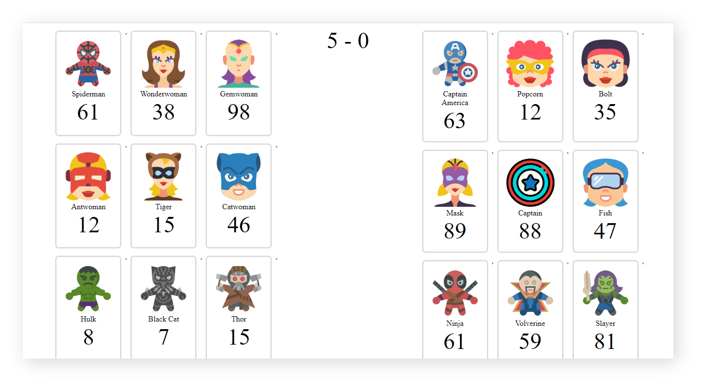

# ProGrad Lab | Superwars Stage 3

Well, in case you forgot the story line, then here it is.

Dustin and Lucus are best friends. They spend their weekends watching superhero series and playing superhero games. One Friday at school Mr.Hooper, their computer science faculty taught them HTML, CSS, and JavaScript. Dustin & Lucus realised they could build super cool super hero stuff using their knowledge. 

The subsequent weekend, they decided to do it. Lucus and Dustin are now all set to build something super cool.

Lucus always loves protagonists like most of us. But Dustin is quite crazy, he likes antagonists. So they decided to collect a bunch of their favorite Super Heroes and Super Villains names along with their pictures. Did they tell you about the game that they are gonna build? 

Okay, let us explain. They are going to facilitate the ultimate war between Super Heroes and Super Villains. As they are new to these technologies, they need a **ProGrad** to help them build this game.

## What should you do
```
Fork this repo
Clone this repo
Practice JavaScript Basics - Operators, Conditions, Loops
```

## How To Submit
```
Upon completion, run the following commands:

git add .
git commit -m "ProGrad ID"
git push origin master

And finally, create a pull request so your ProGrad Mentor (PM) can review your work.
```

## Starter code

The `src/app.js` contains an array of 20 Super Heroes and Super-Villains. We are talking about the array of 20 _strings_ containing each Super Heroes and Super-Villains names. Here is one example of how the data is displayed:

```javascript
[
    "Spiderman"
]
```

### Tests

Open the `SpecRunner.html` file on your browser and start coding to pass the test. Remember to focus on one test at a time and read carefully the instructions to understand what you have to do.

### Progression 1: Keep it simple

In `initPlayers()`, `map` pass a constant array and create JSON Objects, such that each player contains name, strength, image url and type.  
* Use default `strength` as any number.  
* `image` can be sequential i.e. "images/super-"+(i+1)+".png"  
* `type` of player can alternating between hero and villain or your own logic.
* It should _return an array_ of player objects.
    ```javascript
    [
        {
            name:"Super Man",
            strength:100,
            img:"images/hero-1.png",
            type:"hero|villain"
        }
    ]
    ```

### Progression 2: Shrink down

In `buildPlayers()`, instead of using for loop, use chaining of Array methods - filter, map and join to loop through the created JSON objects and accumulate HTML template as below and _return that HTML template_.
 ```JS
<div class="player">
    
    <div class="name">${players[i].name}</div>
    <div class="strength">${players[i].strength}</div>
</div>
```

## Expected Output



Happy Coding ProGrad ❤️
