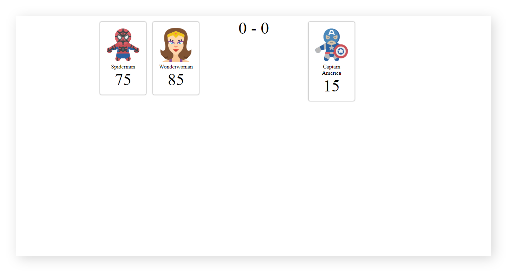

# ProGrad Lab | Superwars Stage 4

Dustin and Lucus are best friends. They spend their weekends watching superhero series and playing superhero games. One Friday at school Mr.Hooper, their computer science faculty taught them HTML, CSS, and JavaScript. Dustin & Lucus realised they could build super cool super hero stuff using their knowledge. 

The subsequent weekend, they decided to do it. Lucus and Dustin are now all set to build something super cool.

Lucus always loves protagonists like most of us. But Dustin is quite crazy, he likes antagonists. So they decided to collect a bunch of their favorite Super Heroes and Super Villains names along with their pictures. Did they tell you about the game that they are gonna build? 

Okay, let us explain. They are going to facilitate the ultimate war between Super Heroes and Super Villains. As they are new to these technologies, they need a **ProGrad** to help them build this game.

## What should you do
```
Fork this repo
Clone this repo
Practice JavaScript OOPS concepts -  _classes, objects, member variables, member functions_
```

## How To Submit
```
Upon completion, run the following commands:

git add .
git commit -m "ProGrad ID"
git push origin master

And finally, create a pull request so your ProGrad Mentor (PM) can review your work.
```

## Starter code

The `src/app.js` contains an array of 20 Super Heroes and Super-Villains. We are talking about the array of 20 _strings_ containing each Super Heroes and Super-Villains names. Here is one example of how the data is displayed:

```javascript
[
    "Spiderman"
]
```

### Tests

Open the `SpecRunner.html` file on your browser and start coding to pass the test. Remember to focus on one test at a time and read carefully the instructions to understand what you have to do.

### Progression 1: Rethink and reuse

Now, add `member variables` like id, name, strength, image and type to `class``Player` and then assign them appropriate values such that they _return a valid player object_.
*  `strength` can be generated from `getRandomStrength()` `member function`, which _returns a random strength_ from 1 to 100 .
* `image` can be sequential i.e. "images/super-"+(i+1)+".png"  
* `type` of player can alternating between hero and villain or your own logic
    ```javascript
    [
        {
            id:1,
            name:"Super Man",
            strength:100,
            img:"images/hero-1.png",
            type:"hero|villain"
        }
    ]
    ```

### Progression 2: Make it subtle

Dustin and Lucus want to display the players. So help them by creating a method `view()`, to accumulate HTML template as below and _return an HTML element_.
```JS
<div class="player" data-id="${players[i].id}">
    
    <div class="name">${players[i].name}</div>
    <div class="strength">${players[i].strength}</div>
</div>
```

### Progression 3: The Superwar

To begin the war there should be players, we can generate players by creating an object for the class `Superwars`, which should use `map` array method to loop through passed constant and _return `Player` Objects_. 

## Expected Output



Happy Coding ProGrad ❤️
