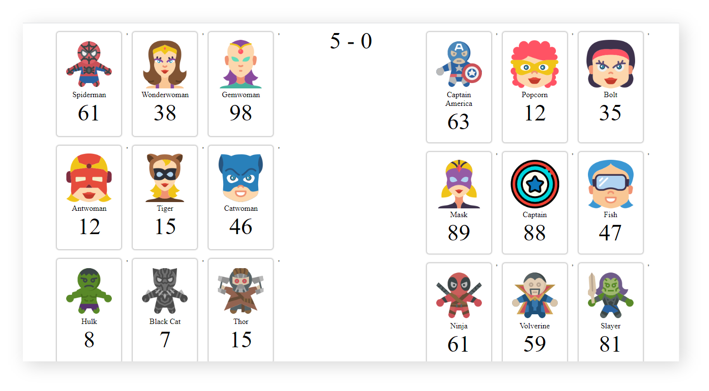

# ProGrad Lab | Superwars Stage 5

Dustin and Lucus are best friends. They spend their weekends watching superhero series and playing superhero games. One Friday at school Mr.Hooper, their computer science faculty taught them HTML, CSS, and JavaScript. Dustin & Lucus realised they could build super cool super hero stuff using their knowledge. 

The subsequent weekend, they decided to do it. Lucus and Dustin are now all set to build something super cool.

Lucus always loves protagonists like most of us. But Dustin is quite crazy, he likes antagonists. So they decided to collect a bunch of their favorite Super Heroes and Super Villains names along with their pictures. Did they tell you about the game that they are gonna build? 

Okay, let us explain. They are going to facilitate the ultimate war between Super Heroes and Super Villains. As they are new to these technologies, they need a **ProGrad** to help them build this game.

## What should you do
```
Fork this repo
Clone this repo
Practice JavaScript OOPS concepts -  _classes, objects, member variables, member functions_
```

## How To Submit
```
Upon completion, run the following commands:

git add .
git commit -m "ProGrad ID"
git push origin master

And finally, create a pull request so your ProGrad Mentor (PM) can review your work.
```

## Starter code

The `src/app.js` contains an array of 20 Super Heroes and Super-Villains. We are talking about the array of 20 _strings_ containing each Super Heroes and Super-Villains names. Here is one example of how the data is displayed:

```javascript
[
    "Spiderman"
]
```

### Tests

Open the `SpecRunner.html` file on your browser and start coding to pass the test. Remember to focus on one test at a time and read carefully the instructions to understand what you have to do.

### Progression 1: Clash of clans

Brace yourself ! We are in the last legs. Help Dustin and Lucus by completing the logic of `isFight()` method such that it should _return `clash`_ when it satisfies the constraint. Otherwise it should _return `peace`_. The given constraint is that a Super Hero and Super Villain with strength greater than zero should be there to make a clash.

### Progression 2: Consistency afford refuge

Dustin and Lucus want to display the scores of the teams. So to display the scores, add logic to the `calculateScore()` method, use reduce array method to loop through players, such that it should _return the score_ for the both the teams.

### Progression 3: Winner winner chicken dinner

Check whether there is a winner by adding your logic to `checkWin()` method. If winner exists then based on the players type _return `hero`_ or _return `villain`_. If winner dosen't exists then _return `endure`_.

### Progression 4: Unity is strength

Hurray! we're just one step away from completion. Add the logic of `totalScore()` method, such that it should _return total strength_ of the team, where team type is passed as parameter.

## Expected Output



Happy Coding ProGrad ❤️
